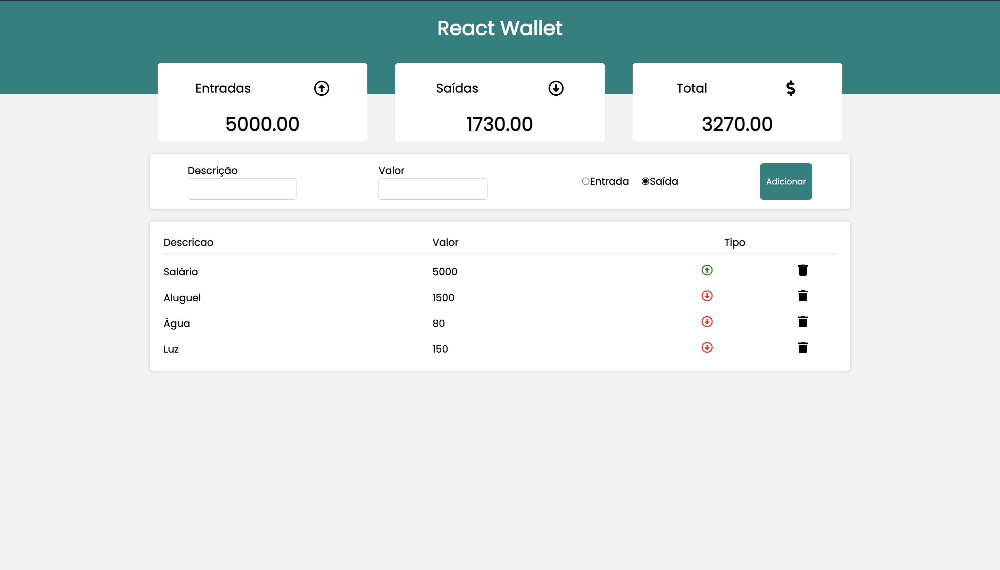

# React Wallet

# 📸 Overview:


# 💻 Project:
React Wallet é uma Aplicação FrontEnd que registra entradas e saídas de uma carteira utilizando o localStorage para armazenamento de dados.

# 🚀 Technologies:
### ✔️ ReactJS
### ✔️ Styled-Components
### ✔️ Vite

# How to run

```
# Clone this repository
$ git clone https://github.com/vinnycosta9898/react-wallet

# Go to the directory
$ cd react-wallet

# Install Dependencies
$ npm i

# Run Web Server
$ npm run dev
